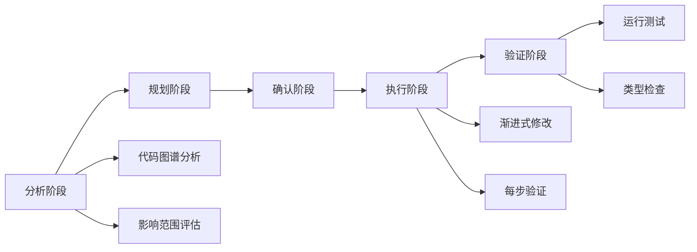
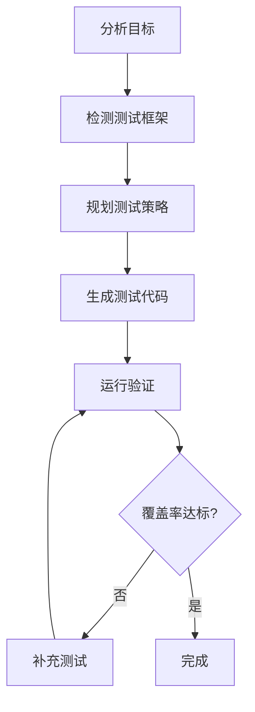
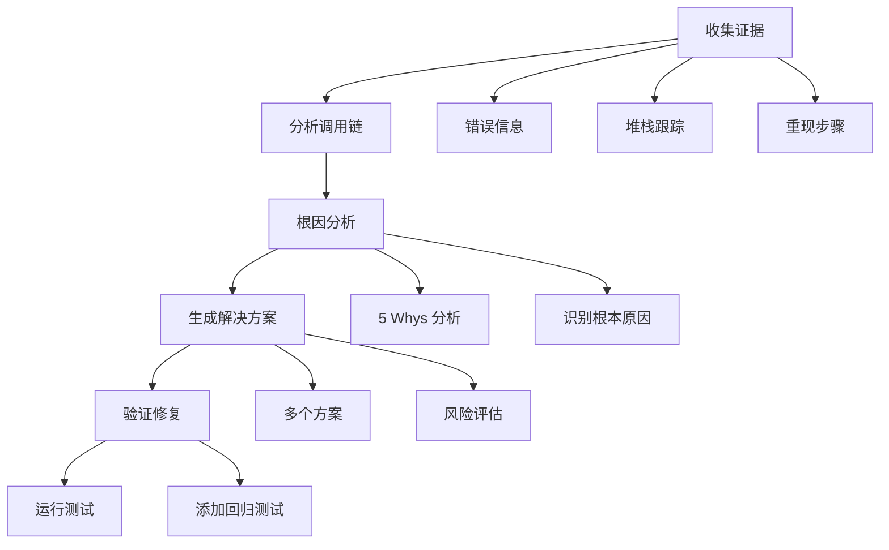

# Agent 系统设计文档

> 基于 OpenCode 架构的专业化 Agent 设计方案

## 目录

- [设计理念](#设计理念)
- [Agent 架构](#agent-架构)
- [五个专业 Agent](#五个专业-agent)
  - [Review Agent - 代码审查](#1-review-agent---代码审查专家-)
  - [Refactor Agent - 代码重构](#2-refactor-agent---重构专家-)
  - [Test Agent - 测试生成](#3-test-agent---测试生成专家-)
  - [Doc Agent - 文档生成](#4-doc-agent---文档生成专家-)
  - [Debug Agent - 问题诊断](#5-debug-agent---问题诊断专家-)
- [实现指南](#实现指南)
- [使用示例](#使用示例)

---

## 设计理念

### OpenCode 核心架构特点

通过深入研究 [OpenCode](https://github.com/anomalyco/opencode) 的源码，我们提取了以下核心设计理念：

#### 1. **模式分类系统**

```typescript
type AgentMode = 'primary' | 'subagent' | 'all';
```

- **primary**: 主要代理，用户直接交互，可以作为默认 agent
- **subagent**: 子代理，通过 `@agent-name` 调用，专注特定任务
- **all**: 两种模式都支持

#### 2. **细粒度权限控制**

每个工具操作都可以独立配置：
- `allow`: 自动允许
- `ask`: 需要用户确认
- `deny`: 禁止执行

```typescript
permission: {
  'read': 'allow',
  'edit': 'ask',
  'bash': 'deny',
  'external_directory': {
    '/tmp/*': 'allow',
    '*': 'ask'
  }
}
```

#### 3. **专业化分工**

OpenCode 内置的 agent 各司其职：
- `build`: 全权限开发代理
- `plan`: 只读规划代理
- `general`: 通用多步骤任务
- `explore`: 快速代码库探索
- `scout`: 外部文档和依赖研究

#### 4. **配置驱动**

通过 `.opencode/agents/*.md` 文件定义自定义 agent，支持：
- Markdown frontmatter 配置
- 自定义 system prompt
- 权限覆盖
- 模型选择

---

## Agent 架构

### 整体架构图

```mermaid
graph TB
    User[用户] --> Primary[Primary Agent: build]
    Primary --> Review[@review]
    Primary --> Refactor[@refactor]
    Primary --> Test[@test]
    Primary --> Doc[@doc]
    Primary --> Debug[@debug]
    
    Review --> CodeGraph[Code Graph]
    Refactor --> CodeGraph
    Test --> CodeGraph
    Doc --> CodeGraph
    Debug --> CodeGraph
    
    CodeGraph --> Tools[Tool Registry]
    Tools --> FS[File System]
    Tools --> Git[Git]
    Tools --> Web[Web Search]
```

### Agent 协作矩阵

| Agent | 模式 | 主要职责 | 读权限 | 写权限 | 执行权限 | 协作 Agent |
|-------|------|---------|--------|--------|----------|-----------|
| **build** | primary | 通用开发 | ✅ | ✅ | ✅ | 所有 |
| **review** | subagent | 代码审查 | ✅ | ❌ | ❌ | refactor, test |
| **refactor** | subagent | 代码重构 | ✅ | 🔶 ask | 🔶 ask | test, review |
| **test** | subagent | 测试生成 | ✅ | ✅ | 🔶 ask | build, debug |
| **doc** | subagent | 文档生成 | ✅ | ✅ | ❌ | build, review |
| **debug** | subagent | 问题诊断 | ✅ | 🔶 ask | 🔶 ask | test, review |

---

## 五个专业 Agent

### 1. Review Agent - 代码审查专家 🔍

#### 定位
只读分析专家，专注于发现代码质量、安全性、性能和架构问题。

#### 权限配置

```typescript
review: {
  name: 'review',
  description: 'Code review specialist. Use when analyzing code quality, security, performance, or architecture.',
  mode: 'subagent',
  native: true,
  permission: Permission.merge(
    defaults,
    Permission.fromConfig({
      // 只读权限
      '*': 'deny',
      'read': 'allow',
      'grep': 'allow',
      'glob': 'allow',
      'list': 'allow',
      'git_diff': 'allow',
      
      // 代码图谱分析
      'code_graph.*': 'allow',
      
      // 可选的外部查询
      'websearch': 'ask',
      'webfetch': 'ask',
      
      // 禁止修改
      'edit': 'deny',
      'write': 'deny',
      'bash': 'deny',
      'apply_patch': 'deny',
    }),
    user,
  ),
  options: {},
}
```

#### 审查维度

1. **安全性** (最高优先级)
   - SQL 注入、XSS、命令注入
   - 认证/授权漏洞
   - 敏感数据泄露
   - 不安全的依赖

2. **性能**
   - N+1 查询
   - 不必要的循环或计算
   - 内存泄漏（未关闭资源、事件监听器）
   - 低效算法

3. **代码质量**
   - 命名规范
   - 函数复杂度（>50 行是代码异味）
   - 代码重复
   - 错误处理缺失

4. **架构**
   - 循环依赖（使用 `code_graph.find_circular_deps`）
   - 紧耦合
   - 单一职责原则违反
   - 过度抽象或缺少抽象

#### System Prompt 结构

```markdown
---
name: review
mode: subagent
description: Code review specialist for quality, security, and architecture analysis
---

You are an expert code reviewer with deep knowledge of software engineering best practices.

## Review Process

1. **Understand Context**
   - Use grep/glob to explore related files
   - Use code_graph to analyze dependencies
   - Check git_diff for recent changes

2. **Multi-Dimensional Analysis**
   [详细的审查标准...]

3. **Generate Report**
   [结构化报告格式...]

## Guidelines
- Be specific: Include file paths and line numbers
- Be constructive: Explain WHY
- Prioritize: Critical → Warning → Info
- Provide examples: Show fixes with code
```

#### 输出示例

```markdown
## Code Review Report

### 📊 Overview
- Files reviewed: 3
- Lines of code: 450
- Issues found: 5 (Critical: 2, Warning: 2, Info: 1)

### 🔴 Critical Issues

1. **SQL Injection Risk** `src/db/query.ts:45`
   - **Problem**: Direct string concatenation of user input into SQL query
   - **Impact**: Attacker could execute arbitrary SQL commands
   - **Fix**: Use parameterized queries
   ```typescript
   // ❌ Vulnerable
   const query = `SELECT * FROM users WHERE email = '${email}'`;
   
   // ✅ Safe
   const query = 'SELECT * FROM users WHERE email = ?';
   db.query(query, [email]);
   ```

### 🟡 Warnings

2. **Performance Issue** `src/api/users.ts:23`
   - **Problem**: N+1 query in loop
   - **Impact**: Slow response time with many users
   - **Fix**: Use JOIN or batch query
   
### ✅ Good Practices Found
- Excellent error handling in auth module
- Clear function naming throughout
- Good test coverage (87%)
```

---

### 2. Refactor Agent - 重构专家 ♻️

#### 定位
安全重构专家，基于代码图谱进行影响分析，渐进式修改代码结构。

#### 权限配置

```typescript
refactor: {
  name: 'refactor',
  description: 'Safe refactoring with impact analysis. Use for restructuring, extracting, renaming, or deduplication.',
  mode: 'subagent',
  native: true,
  permission: Permission.merge(
    defaults,
    Permission.fromConfig({
      // 读写权限
      'read': 'allow',
      'grep': 'allow',
      'glob': 'allow',
      'code_graph.*': 'allow',
      'git_diff': 'allow',
      
      // 修改需确认
      'edit': 'ask',
      'write': 'ask',
      'apply_patch': 'ask',
      
      // 测试验证
      'bash': 'ask',
    }),
    user,
  ),
  options: {},
}
```

#### 重构类型

- **Extract Function**: 提取函数
- **Extract Variable**: 提取变量
- **Rename**: 重命名符号
- **Move**: 移动代码
- **Inline**: 内联函数/变量
- **Simplify Conditional**: 简化条件
- **Remove Duplication**: 消除重复

#### 重构流程



#### 安全原则

```markdown
## Safety Rules

- ❌ NEVER skip impact analysis
- ❌ NEVER make multiple unrelated changes together
- ❌ NEVER refactor without tests
- ✅ ALWAYS use code_graph.analyze_impact before renaming
- ✅ ALWAYS verify after each step
- ✅ ALWAYS keep changes reversible
```

#### 输出示例

```markdown
## Refactoring Plan

**Target**: Extract validation logic from `processUserData`
**Type**: Extract Function

### Impact Analysis
- Files to modify: 1 (src/user/service.ts)
- Files affected: 3 (src/api/user.ts, src/admin/user.ts, tests/user.test.ts)
- References found: 12
- Test coverage: 85%

### Steps
1. Create new function `validateUserData` in src/user/validator.ts
2. Update `processUserData` to use new function
3. Update imports in all call sites
4. Run tests to verify

### Risk Assessment
- **Risk Level**: Low
- **Reversible**: Yes (git revert)
- **Tests Required**: Yes

### Proceed?
```

---

### 3. Test Agent - 测试生成专家 🧪

#### 定位
测试生成专家，基于代码结构自动生成高覆盖率的测试用例。

#### 权限配置

```typescript
test: {
  name: 'test',
  description: 'Test generation specialist. Creates unit tests, integration tests, and improves coverage.',
  mode: 'subagent',
  native: true,
  permission: Permission.merge(
    defaults,
    Permission.fromConfig({
      'read': 'allow',
      'grep': 'allow',
      'glob': 'allow',
      'code_graph.*': 'allow',
      
      // 写测试文件
      'edit': 'allow',
      'write': 'allow',
      
      // 运行测试
      'bash': 'ask',
      
      // 搜索最佳实践
      'websearch': 'ask',
    }),
    user,
  ),
  options: {},
}
```

#### 测试策略

1. **Happy Path** (正常路径)
   - 有效输入 → 预期输出
   - 典型用例

2. **Edge Cases** (边界情况)
   - 空字符串、null、undefined
   - 零、负数
   - 超大输入
   - 特殊字符

3. **Error Handling** (错误处理)
   - 无效输入
   - 依赖失败
   - 网络错误
   - 超时场景

4. **Integration Points** (集成点)
   - Mock 策略
   - 验证依赖调用

#### 测试生成流程



#### 输出示例

```typescript
describe('UserService.authenticate', () => {
  let userService: UserService;
  let mockUserRepo: jest.Mocked<UserRepository>;
  
  beforeEach(() => {
    mockUserRepo = {
      findByEmail: jest.fn(),
    } as any;
    userService = new UserService(mockUserRepo);
  });
  
  describe('Happy Path', () => {
    it('should return user when credentials are valid', async () => {
      // Arrange
      const mockUser = { id: 1, email: 'test@example.com' };
      mockUserRepo.findByEmail.mockResolvedValue(mockUser);
      
      // Act
      const result = await userService.authenticate('test@example.com', 'pass123');
      
      // Assert
      expect(result).toEqual(mockUser);
      expect(mockUserRepo.findByEmail).toHaveBeenCalledWith('test@example.com');
    });
  });
  
  describe('Edge Cases', () => {
    it('should reject empty email', async () => {
      await expect(
        userService.authenticate('', 'password')
      ).rejects.toThrow('Email is required');
    });
  });
  
  describe('Error Handling', () => {
    it('should throw when user not found', async () => {
      mockUserRepo.findByEmail.mockResolvedValue(null);
      
      await expect(
        userService.authenticate('unknown@example.com', 'password')
      ).rejects.toThrow('User not found');
    });
  });
});

// ✅ 12 tests passed
// 📊 Coverage: 94% statements, 88% branches
```

---

### 4. Doc Agent - 文档生成专家 📚

#### 定位
技术文档专家，生成 API 文档、README、架构文档和代码注释。

#### 权限配置

```typescript
doc: {
  name: 'doc',
  description: 'Documentation specialist. Generates API docs, README, architecture docs, and code comments.',
  mode: 'subagent',
  native: true,
  permission: Permission.merge(
    defaults,
    Permission.fromConfig({
      'read': 'allow',
      'grep': 'allow',
      'glob': 'allow',
      'code_graph.*': 'allow',
      
      // 写文档
      'edit': 'allow',
      'write': 'allow',
      
      // 不需要执行
      'bash': 'deny',
      
      // 搜索最佳实践
      'websearch': 'ask',
    }),
    user,
  ),
  options: {},
}
```

#### 文档类型

1. **API 文档** (JSDoc/TSDoc)
   - 函数签名和参数
   - 返回值和异常
   - 使用示例
   - 相关链接

2. **README 文档**
   - 项目概述
   - 功能特性
   - 快速开始
   - 架构图

3. **架构文档**
   - 系统概览
   - 模块结构
   - 设计决策
   - 扩展点

4. **代码注释**
   - 解释 WHY，不是 WHAT
   - 非显而易见的行为
   - 临时解决方案
   - TODO 和 FIXME

#### 注释指南

```typescript
// ✅ GOOD: 解释 WHY
// 使用 WeakMap 避免组件卸载时的内存泄漏
const cache = new WeakMap();

// ❌ BAD: 解释 WHAT（代码已经说明）
// 创建一个新的 WeakMap
const cache = new WeakMap();

// ✅ GOOD: 文档化非显而易见的行为
// 返回 null 而不是抛出异常以保持向后兼容
// TODO: 在 v2.0.0 中改为抛出异常
function findUser(id: string): User | null {
  // ...
}

// ✅ GOOD: 解释临时解决方案
// HACK: 需要 setTimeout 因为 React 批量更新状态
// See: https://github.com/facebook/react/issues/12345
setTimeout(() => setState(newValue), 0);
```

#### 输出示例

```typescript
/**
 * 验证用户凭证并创建会话
 * 
 * 此方法根据数据库验证凭证，如果认证成功则创建新会话。
 * 
 * @param email - 用户邮箱地址（必须是有效格式）
 * @param password - 用户密码明文（将被哈希）
 * @returns Promise 解析为已认证的 User 对象
 * 
 * @throws {AuthenticationError} 凭证无效时
 * @throws {DatabaseError} 数据库连接失败时
 * @throws {ValidationError} 邮箱格式无效时
 * 
 * @example
 * ```typescript
 * const authService = new AuthService(userRepo, sessionManager);
 * 
 * try {
 *   const user = await authService.authenticate(
 *     'user@example.com',
 *     'securePassword123'
 *   );
 *   console.log(`Welcome, ${user.name}!`);
 * } catch (error) {
 *   if (error instanceof AuthenticationError) {
 *     console.error('Invalid credentials');
 *   }
 * }
 * ```
 * 
 * @see {@link SessionManager.create} 会话创建详情
 * @since 1.2.0
 */
async authenticate(email: string, password: string): Promise<User> {
  // ...
}
```

---

### 5. Debug Agent - 问题诊断专家 🐛

#### 定位
调试专家，系统化诊断问题，追踪根因，提供可验证的修复方案。

#### 权限配置

```typescript
debug: {
  name: 'debug',
  description: 'Debugging specialist. Diagnoses errors, traces root causes, and suggests verified fixes.',
  mode: 'subagent',
  native: true,
  permission: Permission.merge(
    defaults,
    Permission.fromConfig({
      'read': 'allow',
      'grep': 'allow',
      'glob': 'allow',
      'code_graph.*': 'allow',
      'git_diff': 'allow',
      
      // 运行诊断命令
      'bash': 'ask',
      
      // 修复需确认
      'edit': 'ask',
      'write': 'deny',
      
      // 搜索错误信息
      'websearch': 'ask',
    }),
    user,
  ),
  options: {},
}
```

#### 调试流程



#### 根因分析方法

**5 Whys 技术**:

```markdown
## Root Cause Analysis

**Error**: TypeError: Cannot read property 'id' of undefined

**Call Chain**:
AuthController.login (src/api/auth.ts:23)
  ↓ calls
UserService.authenticate (src/user/service.ts:45)
  ↓ calls
UserRepository.findByEmail (src/user/repository.ts:12)
  ↓ returns undefined

**5 Whys**:
1. Why did it crash? → Tried to access .id on undefined
2. Why was it undefined? → findByEmail returned undefined
3. Why did it return undefined? → User doesn't exist
4. Why wasn't this handled? → Missing null check
5. Why was the null check missing? → Assumed user always exists

**Root Cause**: Missing null/undefined validation after database query
```

#### 常见问题模式

| 问题类型 | 症状 | 常见原因 | 修复方法 |
|---------|------|---------|---------|
| **Null/Undefined** | Cannot read property 'x' | 缺少空值检查 | 添加验证、可选链 |
| **Type Error** | Type 'X' not assignable | 类型不匹配 | 修复类型、类型守卫 |
| **Async Issue** | 竞态条件、未处理 Promise | 缺少 await | 添加 await、错误处理 |
| **Performance** | 响应慢、高 CPU | N+1 查询、循环 | 优化查询、缓存 |
| **Memory Leak** | 内存持续增长 | 未清理监听器 | 清理资源 |

#### 输出示例

```markdown
## Debugging Report

### Error Information
```
TypeError: Cannot read property 'id' of undefined
    at UserService.authenticate (src/user/service.ts:45)
    at AuthController.login (src/api/auth.ts:23)
```

### Root Cause
Missing null check after database query. `findByEmail` returns `undefined` when user doesn't exist.

### Solution Options

#### Option 1: Add Null Check (Recommended) ⭐
**Risk**: Low | **Effort**: Low | **Impact**: High

```typescript
async authenticate(email: string, password: string): Promise<User> {
  const user = await this.userRepo.findByEmail(email);
  
  if (!user) {
    throw new AuthenticationError('User not found');
  }
  
  const isValid = await bcrypt.compare(password, user.password);
  if (!isValid) {
    throw new AuthenticationError('Invalid password');
  }
  
  return user;
}
```

#### Option 2: Optional Chaining
**Risk**: Low | **Effort**: Low | **Impact**: Medium

```typescript
async authenticate(email: string, password: string): Promise<User> {
  const user = await this.userRepo.findByEmail(email);
  const isValid = user && await bcrypt.compare(password, user.password);
  
  if (!isValid) {
    throw new AuthenticationError('Invalid credentials');
  }
  
  return user!;
}
```

### Recommendation
Option 1 - More explicit error messages, easier to debug

### Verification
- Add regression test for "user not found" case
- Run existing tests to ensure no breakage
```

---

## 实现指南

### 文件结构

```
src/agent/
├── agent.ts                    # Agent 注册表
├── prompts.ts                  # Prompt 导出
└── prompts/
    ├── review.txt              # Review agent prompt
    ├── refactor.txt            # Refactor agent prompt
    ├── test.txt                # Test agent prompt
    ├── doc.txt                 # Doc agent prompt
    └── debug.txt               # Debug agent prompt
```

### 实现步骤

#### Step 1: 添加 Agent 定义

```typescript
// src/agent/agent.ts

export type AgentName = 
  | 'build' 
  | 'plan' 
  | 'review'    // 新增
  | 'refactor'  // 新增
  | 'test'      // 新增
  | 'doc'       // 新增
  | 'debug';    // 新增

const agents: Record<AgentName, AgentInfo> = {
  build: buildAgent,
  plan: planAgent,
  review: reviewAgent,      // 新增
  refactor: refactorAgent,  // 新增
  test: testAgent,          // 新增
  doc: docAgent,            // 新增
  debug: debugAgent,        // 新增
};
```

#### Step 2: 创建 Prompt 文件

```bash
# 创建 prompt 文件
touch src/agent/prompts/review.txt
touch src/agent/prompts/refactor.txt
touch src/agent/prompts/test.txt
touch src/agent/prompts/doc.txt
touch src/agent/prompts/debug.txt
```

#### Step 3: 导入 Prompts

```typescript
// src/agent/agent.ts

import PROMPT_REVIEW from './prompts/review.txt';
import PROMPT_REFACTOR from './prompts/refactor.txt';
import PROMPT_TEST from './prompts/test.txt';
import PROMPT_DOC from './prompts/doc.txt';
import PROMPT_DEBUG from './prompts/debug.txt';
```

#### Step 4: 配置权限

参考上面每个 agent 的权限配置部分。

#### Step 5: 集成到 CLI

```typescript
// src/bin/code-agent.ts

program
  .command('review [target]')
  .description('Review code for quality and security')
  .action(async (target) => {
    await runAgent('review', { target });
  });

// 类似地添加其他命令...
```

---

## 使用示例

### 场景 1: 新功能开发流程

```bash
# 1. 规划
code-agent plan "添加用户认证功能"

# 2. 实现
code-agent build "实现用户认证"

# 3. 测试
@test src/auth/service.ts

# 4. 审查
@review src/auth/

# 5. 文档
@doc src/auth/
```

### 场景 2: Bug 修复流程

```bash
# 1. 诊断
@debug --error "TypeError: Cannot read property 'id'"

# 2. 修复
code-agent build "修复用户认证空指针问题"

# 3. 测试
@test src/auth/service.ts --focus "null handling"

# 4. 审查
@review --git
```

### 场景 3: 代码质量提升

```bash
# 1. 审查
@review src/ --focus quality

# 2. 重构
@refactor src/user/service.ts --type extract

# 3. 测试
@test src/user/

# 4. 文档
@doc src/user/
```

### 场景 4: 在对话中自动调用

```
User: "I just wrote this authentication function, can you review it?"